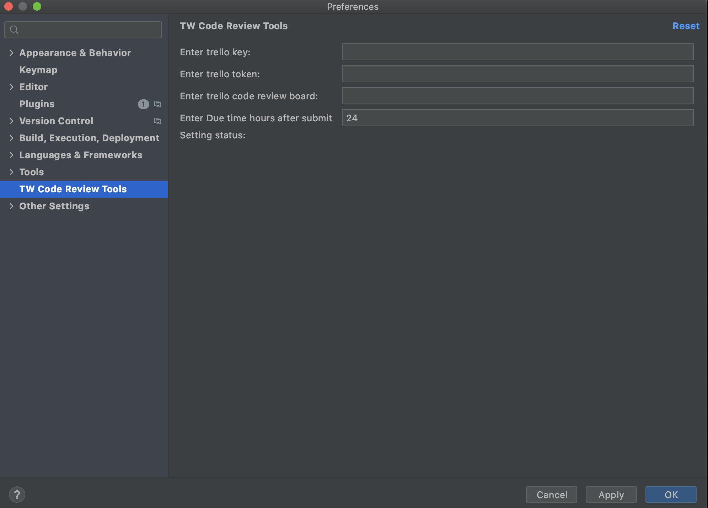
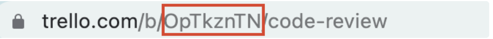
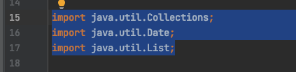
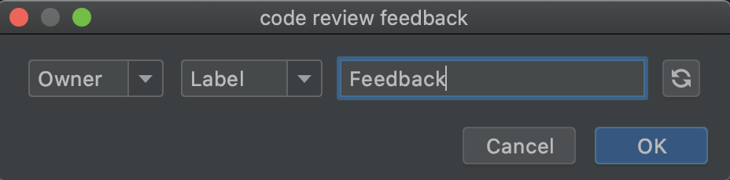

# Thoughtworks code review tools

<!-- Plugin description -->
The purpose of developing this plug-in is to improve the work efficiency of Code Review and the joy of Code Review. The
software will be updated quickly in the near future. Please update to the latest version in time.

开发本插件的目的是 Code Review 提高工作效率，本插件近期会快速迭代更新，请及时更新至最新版本。
<!-- Plugin description end -->

## Installation

- Using IDE built-in plugin system:

  <kbd>Settings/Preferences</kbd> > <kbd>Plugins</kbd> > <kbd>Marketplace</kbd> > <kbd>Search for "
  ThoughtworksCodeReviewTools"</kbd> >
  <kbd>Install Plugin</kbd>

- Manually:

  Download the [latest release](https://github.com/MTWGA/thoughtworks-code-review-tools/releases/latest) and install it
  manually using
  <kbd>Settings/Preferences</kbd> > <kbd>Plugins</kbd> > <kbd>⚙️</kbd> > <kbd>Install plugin from disk...</kbd>

## Configuration
- Set up your trello configuration here:

  
  
- Trello key & token can be got here: [https://trello.com/app-key](https://trello.com/app-key)
  
- Board id can be found in url: 

- Due time will be added to card

## Setup Trello board

- Add members to the Trello board. Member should be displayed in this tool.

- Add labels to the trello board(menu -> label). Label is using for classifying problems we found in code review.

## How to use
  1. Select the code

  
  
  2. Call the tool by default shortcut: cmd + option + i

  3. Enter Owner, Label, feedback, then press enter
  
  

  4. A card will be created with the input information. Owner can click done when the problem is solved.

  4. Use refresh if a new member or label just be added in trello

---

## Contributors

